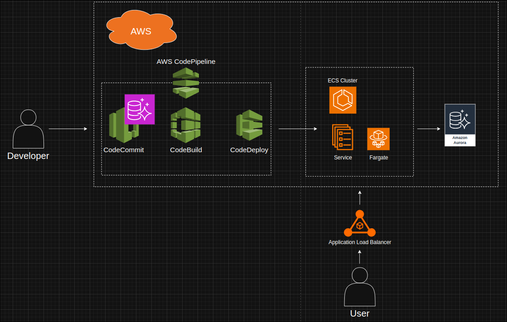

# RELATÓRIO DE IMPLEMENTAÇÃO DE SERVIÇOS AWS
Data: 22 de Julho de 2025

Empresa: Abstergo Industries

Responsável: Gustavo Oliveira Arantes

## Introdução
Este relatório apresenta o processo de implementação de ferramentas na empresa Abstergo Industries, realizado por Gustavo Oliveira Arantes. O objetivo do projeto foi elencar 3 serviços AWS, com a finalidade de realizar diminuição de custos, aumentar a eficiência operacional e modernizar a infraestrutura de tecnologia que suporta as aplicações da companhia.

## Descrição do Projeto
O projeto de implementação de ferramentas foi dividido em 3 etapas, cada uma focada em um pilar da infraestrutura de nuvem: Computação, Banco de Dados e Automação de Deploy. A seguir, serão descritas as etapas do projeto, as ferramentas escolhidas e a justificativa para cada uma.

### Etapa 1:
- **Nome da ferramenta:** AWS Fargate com Amazon ECS (Elastic Container Service)
- **Foco da ferramenta:** Otimização de custos de computação e redução da sobrecarga operacional.
- **Descrição de caso de uso:** As aplicações da empresa serão conteinerizadas com Docker e implantadas no AWS Fargate. Este serviço executa contêineres sem a necessidade de gerenciar servidores, cobrando apenas pelos recursos utilizados durante a execução, reduzindo os custos com capacidade ociosa — especialmente em períodos de menor demanda, como noites e fins de semana. Além disso, elimina a necessidade de gerenciamento de sistemas operacionais, patches de segurança e infraestrutura subjacente, simplificando as operações e proporcionando economia direta e escalabilidade sob demanda.

### Etapa 2:
- **Nome da ferramenta:** Amazon Aurora Serverless
- **Foco da ferramenta:** Redução de custos de licenciamento e de capacidade ociosa do banco de dados.
- **Descrição de caso de uso:** Os bancos de dados relacionais atuais serão migrados para o Amazon Aurora Serverless. Esse serviço ajusta a capacidade do banco de dados em tempo real conforme a demanda da aplicação, permitindo que a empresa pague apenas pelos recursos efetivamente utilizados. Isso elimina custos com capacidade ociosa e licenças tradicionais, mantendo alta performance e disponibilidade, com escalabilidade automática e sem necessidade de gerenciamento manual da infraestrutura.

### Etapa 3:
- **Nome da ferramenta:** AWS CodePipeline
- **Foco da ferramenta:** Automação do processo de build e deploy (CI/CD) para redução de custos operacionais.
- **Descrição de caso de uso:** O processo de deploy será substituído por um pipeline automatizado com o AWS CodePipeline. O serviço orquestra automaticamente todo o fluxo de entrega contínua, integrando a compilação do código via AWS CodeBuild e o deploy da imagem do contêiner no AWS Fargate. Com essa automação, elimina-se a necessidade de gerenciar servidores de CI/CD, reduzindo o esforço dos desenvolvedores com processos manuais de deploy e aumentando tanto a frequência quanto a segurança nas entregas de software.

## Conclusão
A implementação de ferramentas na empresa Abstergo Industries tem como esperado uma otimização significativa de custos através do pagamento por uso, maior agilidade no desenvolvimento com automação de CI/CD e um aumento na confiabilidade e escalabilidade dos sistemas críticos da empresa, o que contribui para o aumento da eficiência e produtividade da empresa. Recomenda-se a continuidade da utilização das ferramentas implementadas e a busca por novas tecnologias que possam melhorar ainda mais os processos da empresa.

## Anexos
### Diagrama de Arquitetura AWS

Assinatura do Responsável do Projeto:
Gustavo Oliveira Arantes
